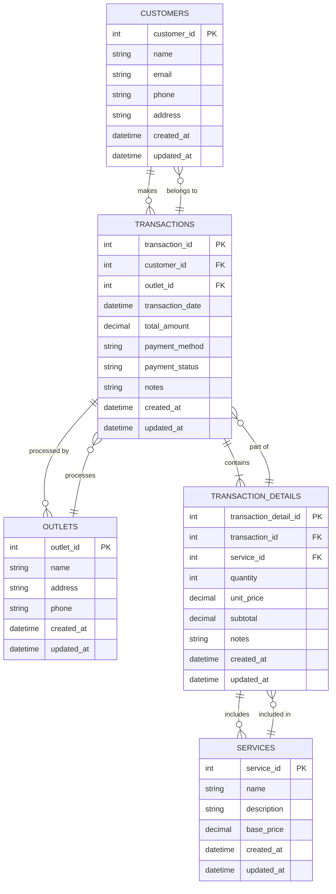
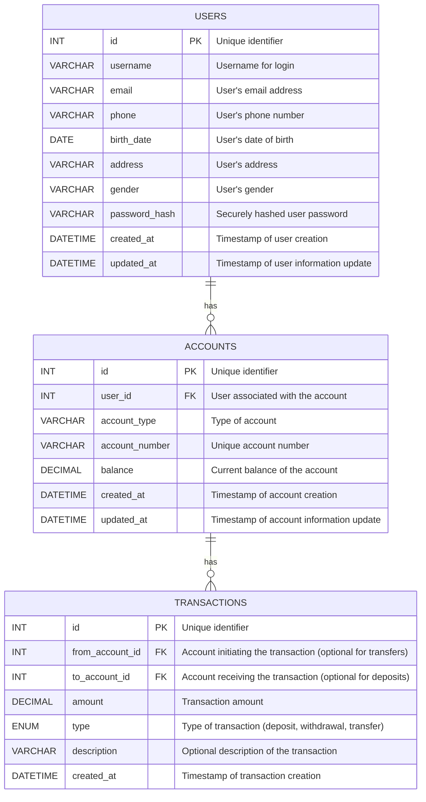

# RevoU Auto Garage Database

This repository contains the database schema, sample data, and example queries for RevoU Auto Garage's transaction and customer management system.

## Project Overview

RevoU Auto Garage is a business that offers various auto services such as changing tires, washing cars, tire spooring, and tire balancing. This database system helps them:

1. Track all transactions across multiple outlets
2. Maintain customer data for future CRM purposes
3. Generate reports on services, revenue, and customer history

## Entity Relationship Diagram

For VSCode preview, you might need the Markdown Preview Mermaid Support extension. Alternatively, here's the database diagram in text format:



## Database Structure

- **customers**: Stores customer information for CRM purposes
- **outlets**: Contains details of all RevoU Auto Garage locations
- **services**: Lists all services offered with descriptions and base prices
- **transactions**: Records all customer transactions with payment information
- **transaction_details**: Contains line items for each transaction with service details

## Files in this Repository

- **schema.sql**: Database table definitions with relationships
- **sample_data.sql**: Test data for demonstration purposes
- **queries.sql**: Example SQL queries for common business needs
- **run_all.sql**: Convenience script to set up the complete database

## Getting Started

To set up the database:

1. Ensure PostgreSQL is installed and running
2. Execute the run_all.sql file:

```bash
psql -f run_all.sql
```


